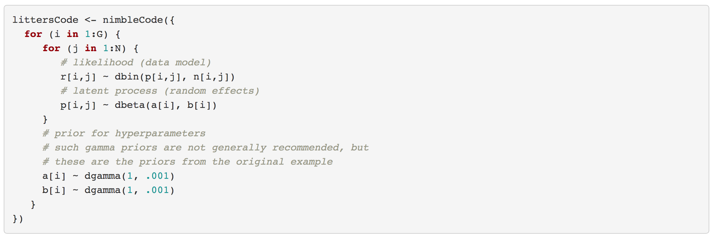
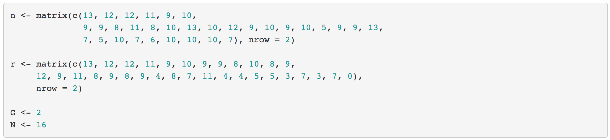
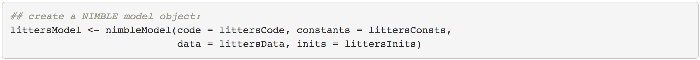
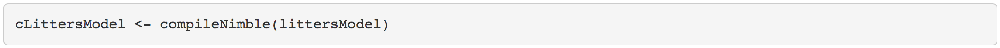

---

\   


### Building a NIMBLE model objet

In BUGS or JAGS, one would provide the model code, input data and constant values, and (optionally) initial parameter values and the software would directly create and run an MCMC, returning the results to you.

In NIMBLE, you have more fine-grained control over these steps. The first step is to build an R representation of the model.

We'll continue using the `litters` example for our first NIMBLE model object.  Again, the litters model code looks like this:

<!--
<center></center>
-->

```{r }
library(nimble)

code <- nimbleCode({
    for (i in 1:G) {
        ## prior for hyperparameters
        ## such gamma priors are not generally recommended, but
        ## these are the priors from the original example
        a[i] ~ dgamma(1, .001)
        b[i] ~ dgamma(1, .001)
        ##
        for (j in 1:N) {
            ## latent process (random effects)
            p[i,j] ~ dbeta(a[i], b[i]) 
            ## likelihood (data model)
            r[i,j] ~ dbin(p[i,j], n[i,j])
        }
    }
})
```

\   

### Code, Constants, Data, and Inits

There are four components to building a NIMBLE model object:

- Model code
- Constants: fixed, unchanging values
- Data: observed values of stochastic nodes
- Initial values: initial values for unobserved stochastic nodes


Question: which are the model **constants**, and which are the model **data** ?


```{r}
n <- matrix(c(13, 12, 12, 11, 9, 10, 
              9, 9, 8, 11, 8, 10, 13, 10, 12, 9, 10, 9, 10, 5, 9, 9, 13, 
              7, 5, 10, 7, 6, 10, 10, 10, 7), nrow = 2)
r <- matrix(c(13, 12, 12, 11, 9, 10, 9, 9, 8, 10, 8, 9, 
              12, 9, 11, 8, 9, 8, 9, 4, 8, 7, 11, 4, 4, 5, 5, 3, 7, 3, 7, 0), 
            nrow = 2)

```

<!--
<center></center>
-->


\   

You can <a href="https://danielturek.github.io/nimble-inra-2019/data/litters_data.Rdata" style="color: blue">download the litters data here</a>.

\   

Now, we're ready to create the lists:

- `constants`
- `data`
- `inits`

Let's discuss what belongs in each one.

```{r }
N <- dim(r)[2]

G <- dim(r)[1]


constants <- list(G = G, N = N, n = n)
data <- list(r = r)
inits <- list(a = c(2, 2), b = c(2, 2))
```

\   

### Creating the NIMBLE model object

Once you've defined the code, constants, data, and initial values, a model object is created using the `nimbleModel` function:


<!--
<center></center>
-->

```{r }
## create a NIMBLE model object:
Rmodel <- nimbleModel(code, constants, data, inits)
```

\  

If all you want to do is run an MCMC, NIMBLE's fine-grained control might not be so interesting to you, in which case you can just use `nimbleMCMC()` without using `nimbleModel()` to create the model. But by providing an explicit model object, we allow you to operate the model and program with it.

\  

### Compiling a model

In general, you'll want a version of the model that allows for fast computation (this can then be used by any algorithms you use on the model).

To create a fast compiled version of the model, you simply do this.

<!--
<center></center>
-->

```{r eval = FALSE}
Cmodel <- compileNimble(Rmodel)
```


\  

### Operating a model

You can view and manipulate the values of variables in the model, and calculate (prior or likelihood) densities and simulate from the prior or likelihood in a model.

In later modules, we'll see why this is useful for

 - Programming algorithms
 - Working with your model (e.g., doing a simulation study)

```{r eval = FALSE}
Rmodel$p
Rmodel$calculate('a')   # log-prior density
Rmodel$getLogProb('a')

Rmodel$a <- c(3, 3)
Rmodel$getLogProb('a')
Rmodel$calculate('a')   # log-prior density

## so the calculations are reproducible
set.seed(1)

Rmodel$simulate('p')  # simulate from prior
Rmodel$p
Rmodel$getLogProb('p')  # log prob not yet updated!
Rmodel$calculate('p')   # update it
Rmodel$getLogProb('p')  # now we're good
```


\  

\  

\  

\  

\  

\  

\  

\  

\  

\  

\  

\  

\  

\  


